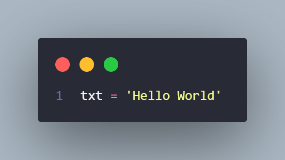

## Nama : Chaerul Hidayat
## NIM  : 312210300

# Latihan1

## Code
 
## Hitung Jumlah Karakter
 
## Ambil Karakter Terakhir
 
## Ambil Karakter Index Ke-2 Dan Ke-4
 
## Hilangkan Spasi Pada Teks Tersebut
 
## Ubah Teks Menjadi Besar
 
## Ubah Teks Menjadi Huruf Kecil
 
## Ganti Karakter H Dengan Karakter J
 
 
## Output
 
## Latihan 2
## Code
 
## Output
  

## Terima Kasih